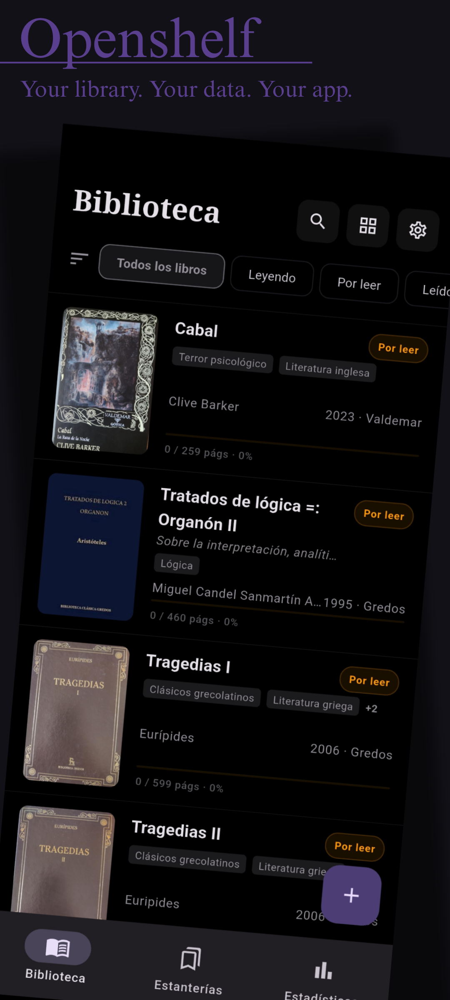
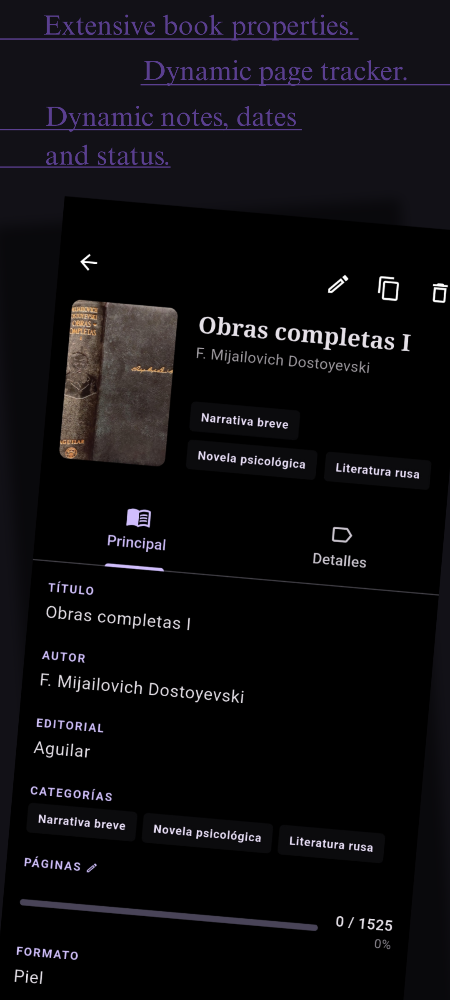
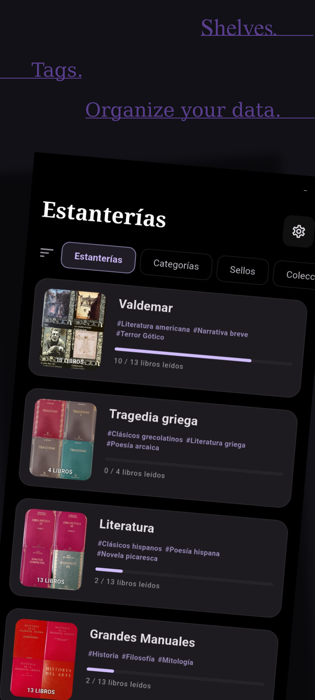
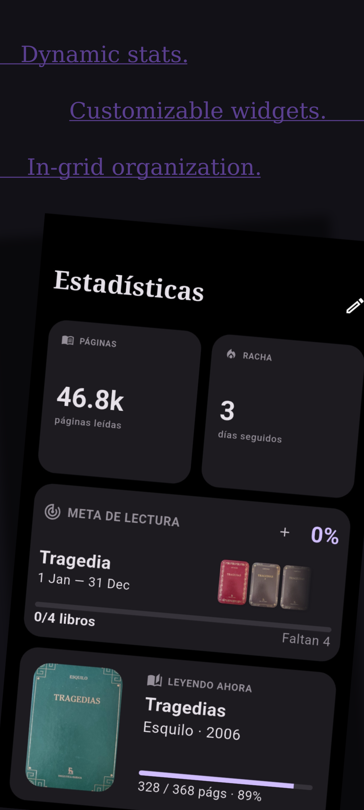

# 📚 Openshelf

**Your library. Your data. Your app.**

Openshelf is a free, open-source personal library manager. It functions as a comprehensive reading tracker, organizer (by category, collection, imprint, or any combination), and book archival tool. Everything stays on your device—no account required, and no data ever leaves your phone.

---

## 🎯 My Intention

I built Openshelf as the definitive app for book archival and tracking. As a collector with a large library, I found every alternative lacking features, hidden behind paywalls, or cluttered with ads.

Openshelf is designed for **book lovers**, not just readers. It is for people who care about the craftsmanship of managing a personal collection. While the open-source stack has some limits in database depth compared to proprietary giants, Openshelf strives to deliver the best experience with high-quality FOSS tools.

---

## 📥 Download

Openshelf is currently in active development. Native stores coming soon:

|    Google Play    |      F-Droid      |
|:-----------------:|:-----------------:|
| 🏗️ *Coming Soon* | 🏗️ *Coming Soon* |

---

## 📱 Screenshots

 | | | |
:---:|:---:|:---:|:---:|
  |  |  |  |

---

## ✨ Features

### 📖 Library
- **Dynamic Views**: Instant toggle between List and Grid layouts.
- **Reading Status**: Five trackable states: *Want to read, Reading, Read, Abandoned, and Paused*.
- **Powerful Search**: Full-text search across Title, Author, ISBN, and personal notes among other advanced filtering.
- **Granular Control**: Cascading ordering in every book or tag list (each with custom ordering).
- **Dynamic Properties**: Enable, disable, or rearrange book fields in the library view at will.

### 📑 Books
- **Custom Covers**: Search via multiple APIs, or use a URL, photo, or gallery for custom covers.
- **Extensive Metadata**: Manage categories, imprints (exclusive), and collections (exclusive).
- **Interactive Forms**: Quick page updates via a **scrollable drum picker** and quick notetaking with infinite space.
- **Progress Tracking**: Automatic reading dates and status updates based on your current page.
- **Dynamic Tags**: Every category, imprint, and collection is fully interactive and searchable within the book form.

### 📂 Smart Shelves
- **Live Views**: Save any filter combination as a self-updating smart shelf.
- **Progress Bars**: Automatic progress indicators for shelves and relevant tags.
- **Visual Mosaics**: Custom mosaic cover displays for your collections.

### 🏷️ Categories
- **Flexible Management**: Add categories via the dedicated page or directly in the book form.
- **Visual Cataloging**: Optional colors for easy identification.
- **Cloud View**: Algorithmic sizing based on book count, using a user-adjustable curve.
- **Graphic Picker**: Intuitive visual selector within the book form.

### 🏢 Imprints
- **Professional Branding**: Support for 1:1 logo images or initial-based placeholders.
- **Dedicated Progress**: Each imprint tracks its own reading progress bar.

### 📚 Collections (Series)
- **Saga Tracking**: Custom cover fade displays for series.
- **Numbered Ordering**: Collections store and display both the name and the book number in the series.
- **Progress Tracking**: Each collection has its own dedicated progress bar.

### 📊 Statistics
- **Custom Dashboard**: Dedicated stats page with reorganizable and resizable widgets.
- **Interactive Widgets**:
    - **Streak (1x1)**: Tracks how many days in a row you have read.
    - **Pages (1x1)**: Total volume of pages in your library.
    - **Goals (1x1 & 2x1)**: Set targets by pages, books, or shelves. Supports multiple goals via swipe with custom progress bars and cover-based backgrounds.
    - **States (1x1)**: Visual distribution across the five reading states.
    - **Now Reading (1x1 & 2x1)**: Swipable and interactable list of active reads.
    - **Added Books (2x2, 2x1, 1x1)**: Temporal graph of acquisitions.
    - **Categories (2x2, 1x2)**: Top 10 genres with names, counts, and colors.
    - **Publishing Year (2x2, 1x2, 2x1)**: Historical bar graph of your library's timeline.
    - **Reading History (2x2, 1x2)**: Yearly breakdown of books finished.
    - **Collections (2x2, 1x2)**: Distribution across your top collections.
    - **Last Added (1x2, 2x1, 1x1)**: Scrollable list of recent arrivals.
    - **Average Length (1x1)**: Average pages per book.
    - **Period Highlights (2x2, 1x2)**: Customizable breakdown of books read (Last month, 3 months, year, or 3 years).
    - **Reading Speed (1x1)**: Average days to complete a book.
- **Haptic Feedback**: Tactile UI interactions for a premium, responsive feel.

---

## 🌐 APIs

Openshelf orchestrates multiple providers simultaneously to ensure high-confidence metadata:

- **[Open Library (FOSS)](https://openlibrary.org)**: Primary source for book metadata and high-quality covers.
- **[Inventaire (FOSS)](https://inventaire.io)**: Secondary source focused on linked open data and deep edition lookups.
- **[Google Books](https://books.google.com)**: Optional proprietary source (requires a free API key).

The app implements a **four-step high-confidence lookup** (ISBN -> Title+Publisher -> Title+Author -> Deep Dive) to ensure you always get the best possible record.

---

## 🛠 Technical Stack

Openshelf is built using modern Flutter development practices with a 100% on-device architecture:

- **Framework**: [Flutter](https://flutter.dev/) (Multi-platform UI).
- **State Management**: [Riverpod](https://riverpod.dev/) (Reactive, thread-safe state handling).
- **Local Database**: [Drift](https://drift.simonbinder.eu/) (High-performance reactive SQLite wrapper).
- **OCR Engine**: [Tesseract OCR](https://github.com/tesseract-ocr/tesseract) (100% FOSS).
- **Scanning**: [Mobile Scanner](https://pub.dev/packages/mobile_scanner).

---

## 💎 Key Code Features

### ⚡ Hybrid FOSS Scanner (Dual-Mode)
To avoid hardware conflicts and provide maximum precision, the scanner implements a mutually exclusive system:
- **Barcode Mode**: High-speed line detection for traditional ISBN barcodes.
- **ISBN Mode (OCR)**: Optimized Tesseract engine tuned with **Page Segmentation Mode (PSM) 7** for single-line recognition. It utilizes **background Isolates** and **lossless PNG processing** to ensure the UI remains at 60fps while recognizing complex or wide fonts.

### 🎬 Zero-Flicker Transitions
The Library view implements a custom `AnimatedSwitcher` logic combined with Riverpod's `skipLoadingOnRefresh`. This allows for a **seamless cross-fade** between List and Grid layouts without any black background flicker or loading spinners, maintaining existing data on screen while the new layout initializes.

### 🖼 Intelligent Image Management
- **Smart Cover Cropping**: Automatic ratio detection (2:3) when downloading covers; triggers a dynamic crop tool if the ratio is off.
- **Background Compression**: Automatic JPEG optimization (max-height 1000px, 75% quality) to keep app storage lean.
- **Lossless Buffer**: Internal use of PNG during OCR processing to ensure zero artifact noise for the recognition engine.

### 🧬 Polymorphic Database Tags
Built on **Drift**, the database uses a polymorphic tag system. A single `Tags` table manages Categories, Imprints, and Collections via a type discriminator. This allows for unified search queries and complex filtering with minimal overhead.

---

## 🌍 Translations

Openshelf uses **[Weblate](https://hosted.weblate.org/projects/openshelf/)** for community translations. English and Spanish are built-in.
> [!TIP]
> To contribute a new language or improve existing ones, visit the [Openshelf project on Weblate](https://hosted.weblate.org/projects/openshelf/).

---

## 🤝 Contributing

Bug reports, feature requests, and pull requests are welcome! 
1. Please open an issue first for anything beyond small fixes.
2. Follow standard Flutter/Dart conventions.
3. Run `flutter analyze` before submitting a PR.

---

## 📜 License

Openshelf is licensed under the **GNU General Public License v3.0**. See the [LICENSE](file:///home/ftena/Projects/Openshelf/LICENSE) file for more details.

---
*Developed with ❤️ for book lovers.*
